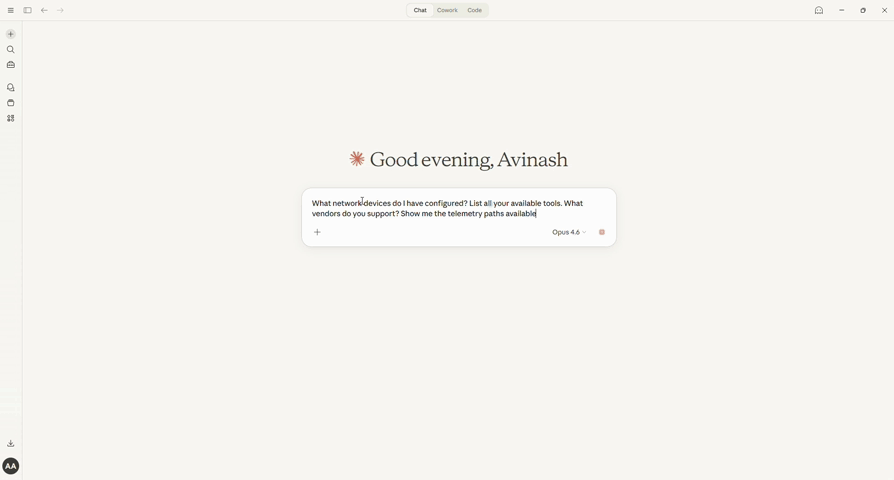
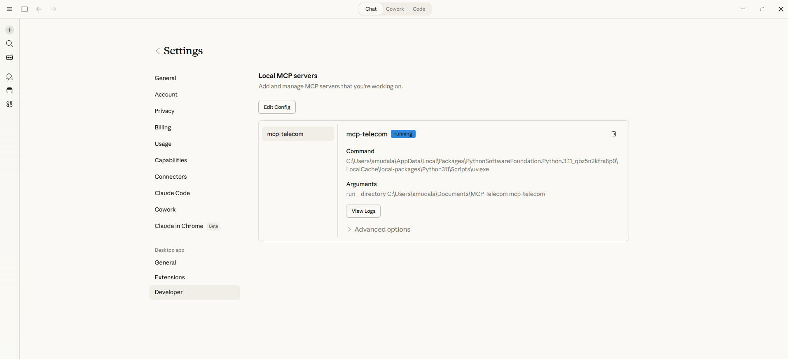

# MCP-Telecom

### Let AI agents talk to your network equipment.

**The first MCP server for Nokia SR OS, Cisco IOS-XR, Juniper Junos, Arista EOS, and Cisco NX-OS routers.**

> _"Hey Claude, show me the BGP summary on nokia-pe1 and check if any peers are down."_

<p align="center">
  
  <br>
  <em>MCP-Telecom in action — asking Claude about network devices, tools, vendors, and telemetry paths</em>
</p>

MCP-Telecom bridges the gap between AI assistants and network infrastructure. It implements the [Model Context Protocol (MCP)](https://modelcontextprotocol.io) to give AI agents like Claude and GPT secure, read-only access to your network devices via SSH — no custom scripts, no fragile automation, just natural language.

---

## Why MCP-Telecom?

| Problem | Solution |
|---|---|
| Network engineers SSH into devices one-by-one | AI queries multiple devices in parallel |
| Vendor CLI syntax differs across Nokia, Cisco, Juniper | Unified interface — one tool works across all vendors |
| Junior engineers struggle with complex troubleshooting | AI-guided workflows with built-in troubleshooting prompts |
| No audit trail for ad-hoc show commands | Every command logged with timestamps |
| Automation scripts break across vendor upgrades | Vendor-abstracted command mappings maintained in one place |

## Features

- **Multi-Vendor Support** — Nokia SR OS, Cisco IOS / IOS-XR / NX-OS, Juniper Junos, Arista EOS
- **40+ Network Tools** — BGP, OSPF, MPLS, interfaces, alarms, NTP, ARP, MAC tables, and more
- **Vendor Abstraction** — Say `bgp_summary` and get the right command for any vendor
- **NETCONF/YANG** — Structured data retrieval via NETCONF alongside traditional SSH CLI
- **Streaming Telemetry** — gNMI-based telemetry subscriptions with in-memory cache
- **Topology Discovery** — Auto-build network maps from LLDP/CDP data with path finding
- **Safety First** — Only read-only commands allowed; destructive commands are blocked
- **Audit Logging** — Every command execution recorded in structured JSONL format
- **Config Backup & Diff** — Backup running configs and compare against previous versions
- **Health Checks** — Test device reachability with response time measurement
- **MCP Resources** — Device inventory, topology, and telemetry as browseable resources
- **Troubleshooting Prompts** — Built-in BGP, interface, and health audit workflows
- **Nokia Service Tools** — VPRN, VPLS, and SAP inspection for Nokia SR OS
- **PyPI Ready** — `pip install mcp-telecom` with optional extras for NETCONF and telemetry
- **Docker Support** — Run containerized with docker-compose
- **CI/CD** — GitHub Actions with multi-Python-version testing and PyPI publishing

## Architecture

```
┌──────────────────────────────────────────────────────────────┐
│                     AI Agent (Claude/GPT)                    │
│                                                              │
│  "Show me BGP neighbors on nokia-pe1 that are down"         │
│  "Discover the network topology"                             │
│  "Subscribe to interface telemetry on cisco-xr1"             │
└──────────────────────┬───────────────────────────────────────┘
                       │  MCP Protocol (stdio)
                       ▼
┌──────────────────────────────────────────────────────────────┐
│                    MCP-Telecom Server                        │
│                                                              │
│  ┌──────────┐ ┌──────────┐ ┌──────────┐ ┌────────────────┐  │
│  │ 40+ Tools│ │Resources │ │ Prompts  │ │ Safety/Audit   │  │
│  └────┬─────┘ └──────────┘ └──────────┘ └────────────────┘  │
│       │                                                      │
│  ┌────▼──────────────────────────────────────────────────┐   │
│  │            Vendor Command Mappings (35+ ops)          │   │
│  │   Nokia ── Cisco ── Juniper ── Arista ── NX-OS        │   │
│  └────┬──────────┬──────────┬────────────────────────────┘   │
│       │          │          │                                │
│  ┌────▼────┐ ┌───▼────┐ ┌──▼──────────┐ ┌───────────────┐   │
│  │  SSH    │ │NETCONF │ │  Streaming  │ │   Topology    │   │
│  │(Netmiko)│ │(YANG)  │ │  Telemetry  │ │  Discovery    │   │
│  │         │ │ncclient│ │   (gNMI)    │ │  (LLDP/CDP)   │   │
│  └────┬────┘ └───┬────┘ └──┬──────────┘ └───────────────┘   │
│       │          │         │                                 │
└───────┼──────────┼─────────┼─────────────────────────────────┘
        │          │         │
        ▼          ▼         ▼
┌──────────┐ ┌──────────┐ ┌──────────┐ ┌──────────┐
│ Nokia    │ │ Cisco    │ │ Juniper  │ │ Arista   │
│ SR OS    │ │ IOS-XR   │ │ Junos    │ │ EOS      │
└──────────┘ └──────────┘ └──────────┘ └──────────┘
```

## Quick Start

### Prerequisites

- Python 3.10+
- [uv](https://docs.astral.sh/uv/) package manager
- SSH access to your network devices

### Installation

```bash
# Install from PyPI (when published)
pip install mcp-telecom

# With NETCONF support
pip install mcp-telecom[netconf]

# With streaming telemetry support
pip install mcp-telecom[telemetry]

# With everything
pip install mcp-telecom[all]

# Or from source
git clone https://github.com/Avinash-Amudala/MCP-Telecom.git
cd MCP-Telecom
uv sync       # or: pip install -e .
```

### Configure Your Devices

```bash
# Copy the example config and edit with your device details
cp devices.yaml.example devices.yaml
```

Edit `devices.yaml` with your actual device credentials:

```yaml
nokia-pe1:
  device_type: nokia_sros
  host: 192.168.1.1
  username: your_username
  password: "${NOKIA_PASSWORD}"   # replace with real creds
  port: 22

cisco-xr1:
  device_type: cisco_xr
  host: 192.168.2.1
  username: your_username
  password: "${CISCO_PASSWORD}"

juniper-mx1:
  device_type: juniper_junos
  host: 192.168.3.1
  username: your_username
  password: "${JUNIPER_PASSWORD}"
```

### Test with MCP Inspector

```bash
npx @modelcontextprotocol/inspector uv run mcp-telecom
```

### Use with Claude Desktop

Add to your Claude Desktop config (`claude_desktop_config.json`):

```json
{
  "mcpServers": {
    "mcp-telecom": {
      "command": "uv",
      "args": [
        "run",
        "--directory",
        "/path/to/MCP-Telecom",
        "mcp-telecom"
      ],
      "env": {
        "MCP_TELECOM_DEVICES_FILE": "/path/to/MCP-Telecom/devices.yaml"
      }
    }
  }
}
```

Once configured, the server appears in Claude Desktop under **Settings → Developer**:

<p align="center">
  
  <br>
  <em>MCP-Telecom registered and running in Claude Desktop's Developer settings</em>
</p>

## Available Tools

### Routing & Protocols

| Tool | Description |
|------|-------------|
| `show_bgp_summary` | BGP neighbor summary with peer states |
| `show_bgp_neighbors` | Detailed BGP neighbor information |
| `show_routing_table` | Full IP routing table |
| `show_ospf_neighbors` | OSPF neighbor adjacencies |
| `show_mpls_lsp` | MPLS Label Switched Paths |

### Interfaces & Layer 2

| Tool | Description |
|------|-------------|
| `show_interfaces` | Interface status summary |
| `show_interface_detail` | Detailed per-interface statistics |
| `show_lldp_neighbors` | LLDP neighbor discovery |
| `show_lag_status` | LAG/Port-Channel/Bundle status |
| `show_arp_table` | IP-to-MAC ARP cache |
| `show_mac_table` | MAC address table |

### System Monitoring

| Tool | Description |
|------|-------------|
| `show_system_info` | Version, uptime, hardware |
| `show_alarms` | Active alarms and alerts |
| `show_ntp_status` | NTP synchronization state |
| `show_cpu` | CPU utilization |
| `show_memory` | Memory utilization |
| `show_environment` | Power, fans, temperature |
| `show_log_events` | Recent syslog messages |

### Configuration & Operations

| Tool | Description |
|------|-------------|
| `backup_config` | Backup running config with timestamp |
| `compare_configs` | Diff live config against a backup |
| `run_command` | Execute any safe read-only command |
| `run_vendor_operation` | Run named operation with auto vendor translation |
| `list_devices` | List all configured devices |
| `list_device_capabilities` | Show supported operations per device |
| `health_check` | Test device reachability |
| `get_audit_log` | View command execution history |
| `show_nokia_services` | Nokia VPRN/VPLS/SAP services |

### NETCONF / YANG

| Tool | Description |
|------|-------------|
| `netconf_get_config` | Retrieve config via NETCONF (structured XML) |
| `netconf_get_operational` | Get operational state via YANG models |
| `netconf_capabilities` | List device YANG module support |

### Streaming Telemetry (gNMI)

| Tool | Description |
|------|-------------|
| `telemetry_subscribe` | Start gNMI telemetry subscription |
| `telemetry_query` | Query latest collected telemetry data |
| `telemetry_history` | Get time-series telemetry for trend analysis |
| `telemetry_list_subscriptions` | List active telemetry subscriptions |
| `telemetry_unsubscribe` | Stop a telemetry subscription |
| `telemetry_list_paths` | Show available OpenConfig telemetry paths |

### Topology Discovery

| Tool | Description |
|------|-------------|
| `discover_topology` | Build network map from LLDP/CDP data |
| `show_topology` | Display ASCII network diagram |
| `show_topology_json` | Export topology as JSON |
| `show_topology_mermaid` | Export topology as Mermaid diagram |
| `find_path` | Shortest path between two devices (BFS) |
| `show_device_neighbors` | List discovered neighbors for a device |

## Supported Platforms

| Vendor | Device Types | Netmiko Type |
|--------|-------------|--------------|
| **Nokia** | 7750 SR, 7950 XRS, 7250 IXR | `nokia_sros` |
| **Cisco** | IOS, IOS-XE | `cisco_ios` |
| **Cisco** | IOS-XR (NCS, ASR) | `cisco_xr` |
| **Cisco** | NX-OS (Nexus) | `cisco_nxos` |
| **Juniper** | MX, QFX, EX, SRX | `juniper_junos` |
| **Arista** | 7000, 7500 series | `arista_eos` |

## Safety & Security

MCP-Telecom enforces strict read-only access:

- **Allowed**: `show`, `display`, `ping`, `traceroute` commands
- **Blocked**: `configure`, `set`, `delete`, `commit`, `reload`, `shutdown`, `write`, `clear`, `reset`, `debug`, and 20+ other dangerous patterns
- **Audit Trail**: Every command execution is logged with timestamp, device, success/failure, and output length

```
[2026-04-06T12:00:00Z] OK   nokia-pe1       show router bgp summary
[2026-04-06T12:00:05Z] OK   cisco-xr1       show ip interface brief
[2026-04-06T12:00:10Z] FAIL cisco-xr1       configure terminal  ← BLOCKED
```

## Docker

```bash
# Build and run
docker-compose up -d

# Or build manually
docker build -t mcp-telecom .
docker run -v ./devices.yaml:/app/devices.yaml:ro mcp-telecom
```

## Development

```bash
# Install dev dependencies
uv sync --all-extras

# Run tests
uv run pytest tests/ -v

# Lint
uv run ruff check src/ tests/

# Test with MCP Inspector
npx @modelcontextprotocol/inspector uv run mcp-telecom
```

## Project Structure

```
MCP-Telecom/
├── src/mcp_telecom/
│   ├── __init__.py          # Package init
│   ├── server.py            # MCP server (40+ tools, resources, prompts)
│   ├── connection.py        # SSH connection manager (Netmiko)
│   ├── models.py            # Pydantic data models
│   ├── safety.py            # Command safety validation
│   ├── audit.py             # Structured JSONL audit logging
│   ├── topology.py          # LLDP/CDP topology discovery & path finding
│   ├── vendors/
│   │   ├── __init__.py
│   │   └── mappings.py      # Vendor-specific command mappings (6 vendors)
│   ├── transports/
│   │   ├── __init__.py
│   │   ├── netconf.py       # NETCONF/YANG transport (ncclient)
│   │   └── telemetry.py     # gNMI streaming telemetry collector
│   └── tools/
│       ├── __init__.py
│       ├── routing.py       # Routing protocol tools
│       ├── interfaces.py    # Interface monitoring tools
│       └── system.py        # System monitoring tools
├── tests/                   # 118 tests
├── examples/                # Usage examples and Claude Desktop config
├── .github/workflows/
│   ├── ci.yml               # CI pipeline (Python 3.10-3.12 + Docker)
│   └── publish.yml          # PyPI publish on GitHub release
├── pyproject.toml           # Project config with optional extras
├── Dockerfile               # Container support
├── docker-compose.yml       # Docker Compose config
├── devices.yaml.example     # Example device config
└── README.md                # This file
```

## Roadmap

- [x] **NETCONF/YANG** — Structured data retrieval via NETCONF
- [x] **Streaming telemetry** — gNMI-based real-time telemetry collection
- [x] **Topology discovery** — Auto-build network maps from LLDP/CDP
- [x] **PyPI publishing** — `pip install mcp-telecom`
- [ ] **MCP Registry listing** — Publish to the [official MCP Registry](https://modelcontextprotocol.io/registry)
- [ ] **Remote MCP server** — HTTP/SSE transport for Claude's MCP Directory listing
- [ ] **SNMP support** — Poll SNMP MIBs alongside SSH
- [ ] **Connection pooling** — Persistent SSH sessions for faster queries
- [ ] **Config compliance** — Check configs against golden templates
- [ ] **Multi-device queries** — Run commands across device groups simultaneously
- [ ] **Web dashboard** — Real-time device status dashboard
- [ ] **Prometheus metrics** — Export network metrics for Grafana

## Contributing

Contributions are welcome! See [CONTRIBUTING.md](CONTRIBUTING.md) for guidelines.

## License

[MIT](LICENSE) — Avinash Amudala

---

**Built with [MCP](https://modelcontextprotocol.io) + [Netmiko](https://github.com/ktbyers/netmiko) + [FastMCP](https://github.com/jlowin/fastmcp)**
